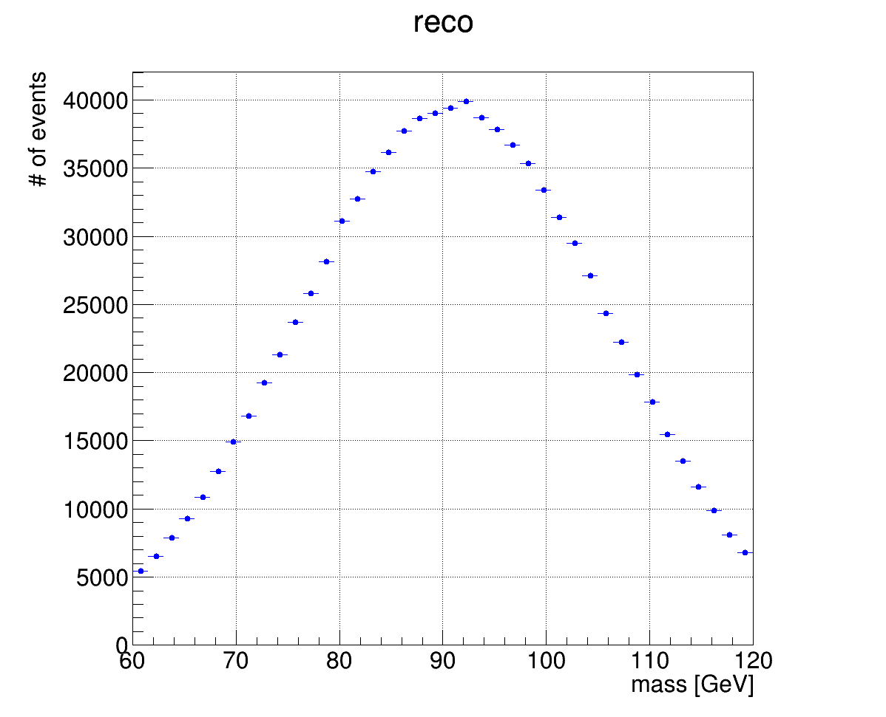
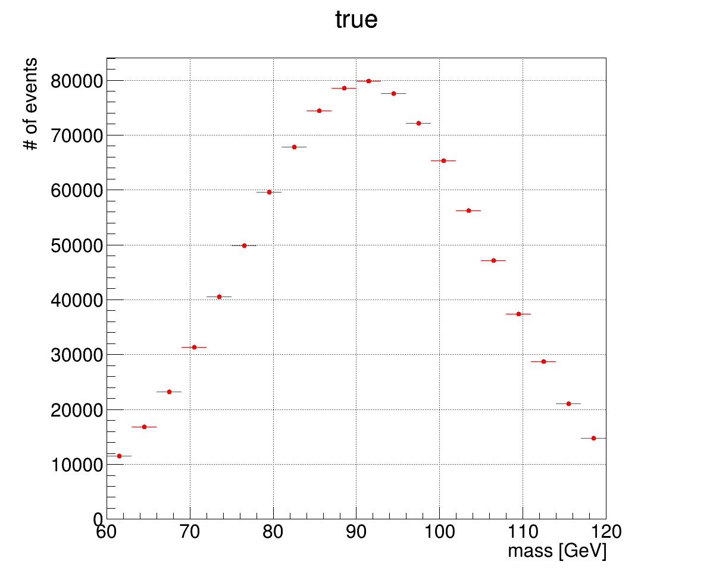
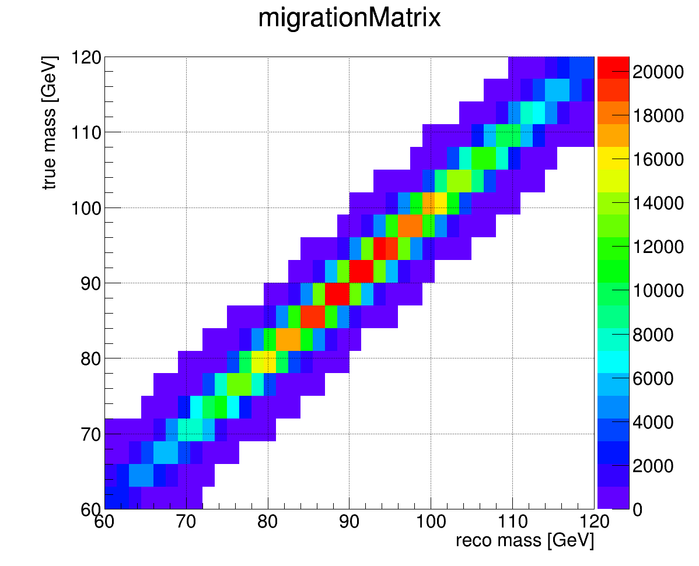
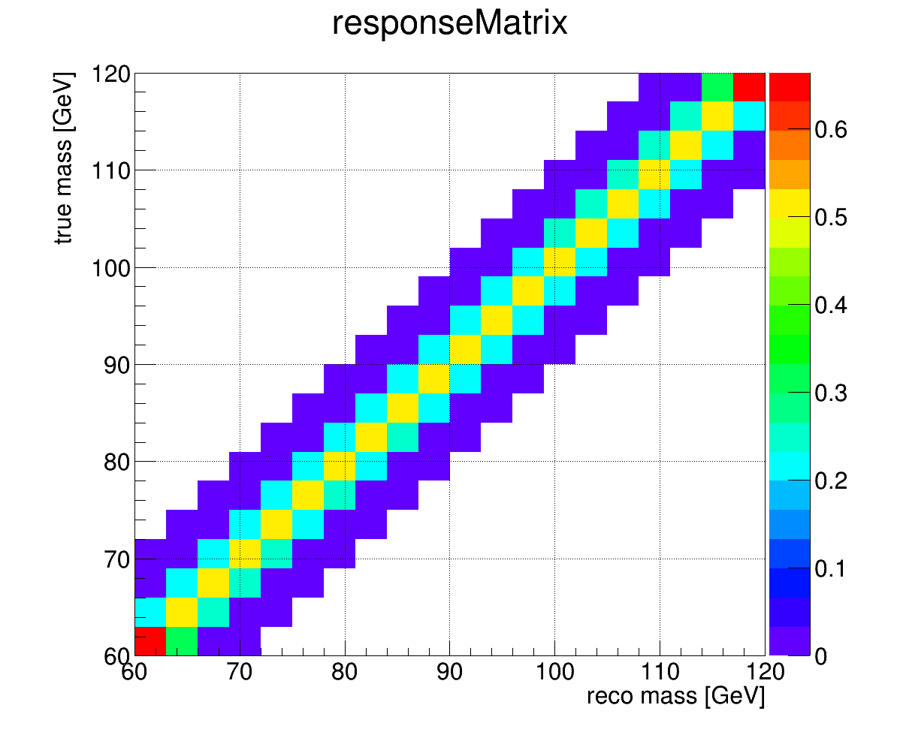
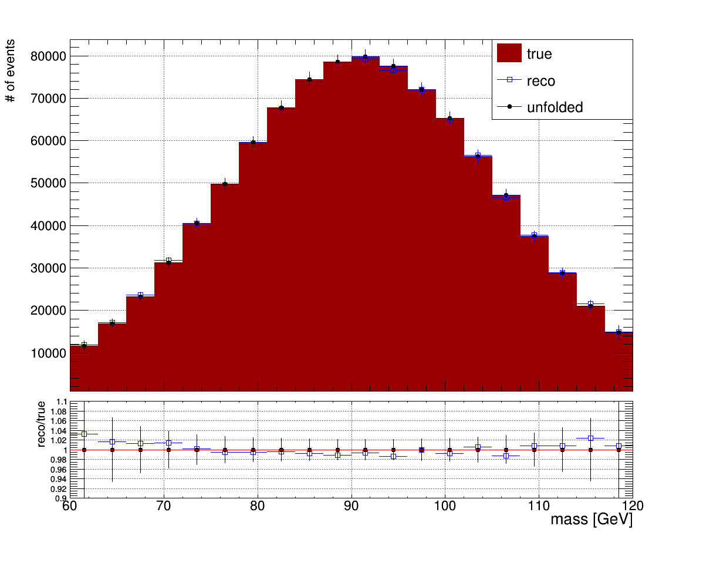

# UnfoldForYash
One of the first things I always check for unfolding, is the consistency of the true and reconstructed distributions with the migration matrix. If unfolding is to work, the x and y projections of the migration matrix should exactly match the true and reco distributions if they are made from the same Monte Carlo. To check this, I created the script, checkResults.C. I also added a bash script called CheckResults.sh which can be used like this:
```
chmod u+x CheckResults.sh
./CheckResults.sh name_of_file.root
```

The first line is only needed to set permissions for the bash script so that you can run it as an executable. This only needs to be done once. I ran this on the root file you sent me:
```
./CheckResults.sh yash_unfolding.root
```
First, it checks the normalization of the response matrix. The output running on your response matrix looks like this:
```
number of events in row 1: 0.00512198
number of events in row 2: 0.00512198
number of events in row 3: 0.00512198
number of events in row 4: 0.00512198
number of events in row 5: 0.00512198
number of events in row 6: 0.00512198
number of events in row 7: 0.00512198
number of events in row 8: 0.00512198
number of events in row 9: 0.00512198
number of events in row 10: 0.00512198
number of events in row 11: 0.00512198
number of events in row 12: 0.00512198
number of events in row 13: 0.00512442
number of events in row 14: 0.00512198
number of events in row 15: 0.00512198
number of events in row 16: 0.00512442
number of events in row 17: 0.0051293
number of events in row 18: 0.00513418
number of events in row 19: 0.00513418
number of events in row 20: 0.0051537
number of events in row 21: 0.00515857
number of events in row 22: 0.00519273
number of events in row 23: 0.00523176
number of events in row 24: 0.00534643
number of events in row 25: 0.00536594
number of events in row 26: 0.0287204
number of events in row 27: 0.0270786
number of events in row 28: 0.025305
number of events in row 29: 0.0240193
number of events in row 30: 0.0227238
number of events in row 31: 0.0219358
number of events in row 32: 0.0212381
number of events in row 33: 0.0209649
number of events in row 34: 0.0212942
number of events in row 35: 0.0217748
number of events in row 36: 0.0220651
number of events in row 37: 0.0226409
number of events in row 38: 0.0233972
number of events in row 39: 0.023929
number of events in row 40: 0.0240705
number of events in row 41: 0.0246316
number of events in row 42: 0.0246902
number of events in row 43: 0.0240656
number of events in row 44: 0.0238607
number of events in row 45: 0.02288
number of events in row 46: 0.0215333
number of events in row 47: 0.0207575
number of events in row 48: 0.0186155
number of events in row 49: 0.0173957
number of events in row 50: 0.0155904
number of events in row 51: 0.0140656
number of events in row 52: 0.0125213
number of events in row 53: 0.0111771
number of events in row 54: 0.0101988
number of events in row 55: 0.00913515
number of events in row 56: 0.00836668
number of events in row 57: 0.00757624
number of events in row 58: 0.0070566
number of events in row 59: 0.00674921
number of events in row 60: 0.00634667
number of events in row 61: 0.00616858
number of events in row 62: 0.00596853
number of events in row 63: 0.005788
number of events in row 64: 0.00569529
number of events in row 65: 0.0056343
number of events in row 66: 0.00554892
number of events in row 67: 0.00557331
number of events in row 68: 0.00551232
number of events in row 69: 0.00542449
number of events in row 70: 0.00542449
number of events in row 71: 0.00538058
number of events in row 72: 0.00537326
number of events in row 73: 0.00533423
number of events in row 74: 0.00530251
number of events in row 75: 0.00526348
number of events in row 76: 0.00530007
number of events in row 77: 0.00526348
number of events in row 78: 0.0052586
number of events in row 79: 0.00520981
number of events in row 80: 0.00519761
number of events in row 81: 0.00521225
number of events in row 82: 0.00519029
number of events in row 83: 0.00518053
number of events in row 84: 0.00518541
number of events in row 85: 0.00519273
number of events in row 86: 0.00517077
number of events in row 87: 0.0051537
number of events in row 88: 0.00516102
number of events in row 89: 0.00515857
number of events in row 90: 0.00516345
number of events in row 91: 0.00514638
number of events in row 92: 0.00514882
number of events in row 93: 0.00515126
number of events in row 94: 0.00514882
number of events in row 95: 0.00515857
number of events in row 96: 0.00513906
number of events in row 97: 0.00513174
number of events in row 98: 0.00513418
number of events in row 99: 0.00513662
number of events in row 100: 0.00513906
```

This means the response matrix was not created correctly. 

The other output is a plot of the true and reco distributions on the x and y projections of the migration matrix. As you can see below, something is missing. I didn't include a legend here, but the lines are the true and reco distributions. The projections should be little filled circles, but they are not visible on this plot. This is because the scale is way larger than in the 1D distributions, but they should be the same.


# How to produce toy models for unfolding
Create 1D histograms for the true and reconstuctructed distributions and a 2D histogram with the true and reco binning (our analysis has true on the y-axis and reco on the x-axis). TUnfold requires that the reco distributions has more bins than the true distribution. For the sake of this tutorial, I simply made reco have twice as many bins as true. In our analysis, we are instead using a second variable to the reco distribution, but we will get into that some other time. For now, this will be sufficient. 

Next, create a function (or use one built-in to ROOT like Gaus()) to randomly select your variable from. In our case, we are unfolding invariant mass, so I will use a simple gaussian centered at the z boson mass (91 GeV). I arbintrarily chose the width of that peak to be 15 GeV. Now, to get a simple reconstructed distribution, we need to assum some amount of smearing on the original true masses. This is due to the finite resolution of the detector. So I created another random number to represent the amount of smearing by selecting from another gaussian centered at 0 with a width of 2. The width was chosen simply to be small enough that we wouldn't see very large bin migrations. All of these options can be further refined and tested to get more realistic distributions. To take realism even further, one would need to consider the effect of different event weights used in true and reco events, and the selection efficiency. We will get to that in the future.

Below are my reco and true distributions:



The migration matrix needs to be filled event-by-event with the same variables as the true and reco distribution. It should be somewhat diagonal with some spreading along the diagonal. In a more realistic case, there will be effects other than simple smearing, so this will not always be the case. But for now, this is what we should see. Below is the migration matrix and response matrix produced along with the true and reco distributions above:




Note that for the response matrix, I have rebinned the x-axis to make it square. This just makes it a little nicer to interpret. 
Finally, let's run CheckResullts.sh on the output:
```
./CheckResults.sh robert_unfolding.root

number of events in row 1: 1
number of events in row 2: 1
number of events in row 3: 1
number of events in row 4: 1
number of events in row 5: 1
number of events in row 6: 1
number of events in row 7: 1
number of events in row 8: 1
number of events in row 9: 1
number of events in row 10: 1
number of events in row 11: 1
number of events in row 12: 1
number of events in row 13: 1
number of events in row 14: 1
number of events in row 15: 1
number of events in row 16: 1
number of events in row 17: 1
number of events in row 18: 1
number of events in row 19: 1
number of events in row 20: 1
```


In this case, the response matrix appears to be normalized correctly and the matrix projections match the true and reco distributions. Due to the scale of these plots in the actual analysis, it can be difficult to see if two plots match exactly, and you'll want to usually include a ratio plot to confirm. But in this case, I'm going to skip it.

# How to carry out unfolding on a simple model
Import the histograms created from the toy models, set all necessary options, and then tell TUnfold which distribution is to be unfolded, which matrix is your migration matrix, and any backgrounds being used. In this case we are not adding backgrounds, so they are not present. I wrote detailed comments in the script robert_unfold.C, so go there and read through it to unerstand the details.

Here is the unfolding closure test carried out on the toy model shown here:


You can see in the ratio plot that the reco distribution varies from the true one by up to around 4%, but the unfolded distribution appears to exactly match the true distribution as expected.
